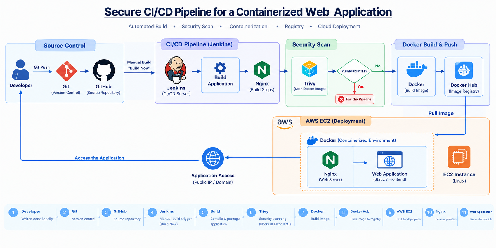

# Secure CI/CD Pipeline for a Containerized Web Application

## 📌 Overview

This project demonstrates an automated **CI/CD and DevSecOps pipeline** for building, security-scanning, containerizing, and deploying a web application.

The pipeline uses **GitHub, Jenkins, Trivy, Docker, Docker Hub, Nginx, and AWS EC2** to automate the software delivery workflow and introduce security scanning before deployment.

The project was designed to reduce manual deployment effort, improve deployment consistency, and detect container vulnerabilities before the application is deployed.

---

## 🎯 Problem Statement

Traditional application deployments often involve several manual steps:

* Building the application manually
* Creating Docker images manually
* Checking container security manually
* Uploading images manually
* Deploying containers manually
* Repeating the same process for every code change

This can lead to deployment errors, inconsistent processes, and security vulnerabilities reaching the deployment environment.

This project addresses these problems by creating an automated pipeline that:

1. Retrieves application source code from GitHub
2. Executes the CI/CD pipeline through Jenkins
3. Builds the application
4. Scans the container image using Trivy
5. Builds a Docker image
6. Pushes the image to Docker Hub
7. Deploys the containerized application
8. Serves the application using Nginx

---

## 🏗️ Architecture



---

## 🛠️ Technologies Used

| Technology | Purpose                                        |
| ---------- | ---------------------------------------------- |
| Linux      | Server environment and command-line operations |
| Git        | Version control                                |
| GitHub     | Source code repository                         |
| Jenkins    | CI/CD automation                               |
| Bash       | Shell scripting and automation                 |
| Docker     | Application containerization                   |
| Docker Hub | Container image registry                       |
| Trivy      | Container vulnerability scanning               |
| Nginx      | Web server                                     |
| AWS EC2    | Cloud compute environment                      |
| SSH        | Secure server administration                   |

---

## 🔄 CI/CD Workflow

The pipeline follows this workflow:

```text
Developer
    ↓
Git
    ↓
GitHub
    ↓
Jenkins
    ↓
Application Build
    ↓
Trivy Security Scan
    ↓
Docker Image Build
    ↓
Docker Hub
    ↓
AWS EC2
    ↓
Docker Container
    ↓
Nginx
    ↓
Application
```

### 1. Source Code Management

The application source code is maintained in Git and stored in GitHub.

Git is used for:

* Repository management
* Version control
* Commits
* Branching
* Pushing code changes

---

### 2. Jenkins Pipeline

Jenkins is used as the CI/CD automation server.

The Jenkins pipeline is defined using a **Jenkinsfile** and follows a declarative pipeline structure.

The pipeline automates the major stages of the application delivery process.

---

### 3. Application Build

Jenkins retrieves the application source code and performs the required build steps.

The project uses a Node.js-based application rather than a Java/Maven application.

---

### 4. Security Scanning

**Trivy** is integrated into the pipeline to scan the Docker image for known vulnerabilities.

The pipeline is configured to identify serious vulnerabilities before the image proceeds through the deployment workflow.

Example:

```text
Docker Image
     ↓
   Trivy
     ↓
Vulnerability Scan
     ↓
Pass / Fail
```

This introduces a basic **DevSecOps security gate** into the CI/CD pipeline.

---

### 5. Docker Image Creation

The application is packaged into a Docker image.

Docker provides:

* Application isolation
* Consistent runtime environment
* Portable deployment
* Reproducible application packaging

---

### 6. Docker Hub

The Docker image is pushed to Docker Hub.

Example image:

```text
meghasm10304/secure-cicd-pipeline
```

Docker Hub acts as the container image registry from which the deployment environment can retrieve the image.

---

### 7. Deployment on AWS EC2

The application is deployed to an **Amazon EC2 instance**.

The EC2 server provides the Linux environment required to run the Docker container.

The deployment workflow is:

```text
Docker Hub
     ↓
AWS EC2
     ↓
Docker
     ↓
Container
```

---

### 8. Nginx

Nginx is used as the web server for serving the application.

The application runs inside a container and Nginx handles web traffic to the application.

---

## 🔐 Security

Security is incorporated into the CI/CD workflow using Trivy.

The pipeline performs vulnerability scanning before the container image is allowed to continue through the delivery process.

This helps identify known vulnerabilities in:

* Container operating-system packages
* Application dependencies
* Container image components

The project demonstrates the principle of:

> **Shift security left**

Security checks are performed during the software delivery process instead of relying only on post-deployment checks.

---

## 🐳 Docker

The application is containerized using Docker.

Typical workflow:

```bash
docker build
    ↓
docker image
    ↓
trivy image
    ↓
docker push
    ↓
docker pull
    ↓
docker run
```

Useful Docker operations practiced during the project include:

```bash
docker build
docker images
docker ps
docker ps -a
docker run
docker stop
docker start
docker logs
docker exec
docker push
docker pull
```

---

## ⚙️ Jenkins Pipeline Stages

The pipeline follows a structure similar to:

```text
Checkout
   ↓
Build
   ↓
Security Scan
   ↓
Docker Build
   ↓
Docker Push
   ↓
Deployment
```

The exact stages may vary depending on the application and deployment configuration.

---

## 📂 Project Structure

```text
secure-cicd-pipeline/
│
├── Jenkinsfile
├── Dockerfile
├── package.json
├── package-lock.json
├── nginx.conf
├── src/
│
├── README.md
└── .gitignore
```

> The exact files and directories may vary depending on the current application implementation.

---

## ☁️ AWS Infrastructure

The project uses Amazon EC2 as the deployment environment.

High-level infrastructure:

```text
AWS
│
└── EC2
    │
    ├── Linux
    │
    ├── Docker
    │
    └── Container
        │
        └── Nginx
            │
            └── Web Application
```

SSH is used for secure administrative access to the EC2 instance.

---

## 🧪 Testing and Validation

The project was validated by:

* Running Jenkins pipeline builds
* Verifying successful source-code checkout
* Building Docker images
* Running Docker containers
* Performing Trivy security scans
* Pushing images to Docker Hub
* Pulling and running images on the deployment server
* Verifying application availability
* Troubleshooting Jenkins agent connectivity
* Troubleshooting SSH connectivity
* Verifying Docker container status and logs

---

## 📚 Key Concepts Learned

Through this project, the following concepts were practiced:

### CI/CD

* Continuous Integration
* Continuous Delivery
* Pipeline automation
* Declarative Jenkins pipelines
* Build stages
* Deployment automation

### Git

* Repository management
* Commits
* Push and pull operations
* Branching concepts
* Source-code version control

### Docker

* Images
* Containers
* Dockerfile
* Container lifecycle
* Image registries
* Container logs
* Port mapping

### DevSecOps

* Security scanning
* Vulnerability detection
* Security gates
* Shift-left security

### AWS

* EC2
* Linux-based cloud servers
* SSH access
* Cloud deployment

### Linux & Bash

* Linux administration
* Package installation
* File and directory management
* Process management
* Shell commands
* Automation scripts

---

## 🚀 Future Improvements

The current project focuses on the core CI/CD and container security workflow.

Possible future enhancements include:

* GitHub webhook-based automatic pipeline triggering
* SonarQube integration for static code analysis
* AWS Elastic Container Registry (ECR)
* Kubernetes-based deployment
* Helm
* Infrastructure provisioning with Terraform
* Monitoring with Prometheus and Grafana
* Centralized logging
* HTTPS/TLS configuration
* Automated rollback
* Blue-green or rolling deployments

These technologies are intentionally kept as future enhancements rather than being represented as completed components of the current implementation.

---

## 🎓 Project Outcome

This project demonstrates the implementation of a practical **CI/CD and DevSecOps workflow** for a containerized web application.

The project combines:

```text
Source Control
      +
CI/CD Automation
      +
Security Scanning
      +
Containerization
      +
Container Registry
      +
Cloud Deployment
```

The result is a repeatable software delivery workflow that reduces manual deployment steps and introduces security validation into the CI/CD process.

---

## 👩‍💻 Author

**Meghana M**

Computer Science & Engineering
Cloud / DevOps Enthusiast

---

## ⭐ Project Highlights

* Automated CI/CD pipeline using Jenkins
* GitHub-based source control
* Docker containerization
* Trivy container security scanning
* Docker Hub image registry
* AWS EC2 deployment
* Nginx web server
* Linux and Bash automation
* Hands-on troubleshooting of CI/CD infrastructure
